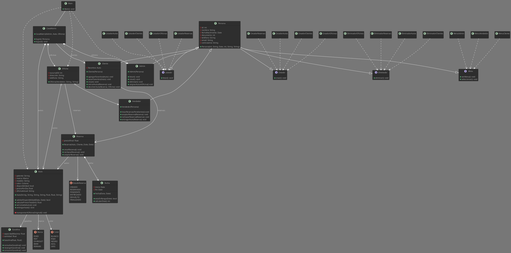
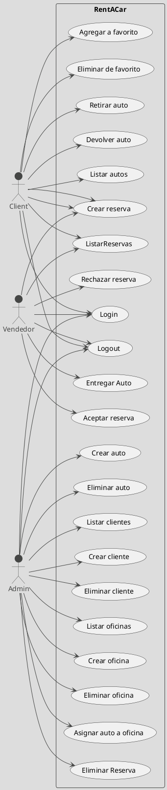

# Proyecto Rent A Car

## Descripción
Primer parcial de programación II de la carrera Infórmatica Aplicada de INSPT-UTN.
Comisión 2.603

## Docentes
- Prof. Dr. Diego Corsi
- Prof. Matías Ávalos
  
## Integrantes
- [Hugo Miranda Campos](https://github.com/hvgomiranda)
- [Franco Andrés Spinelli](https://github.com/FrancoSpinelli)

## Consigna
Desarrolle un sistema para gestionar la información de las reservas de una empresa dedicada al
alquiler de automóviles, teniendo en cuenta que:

- En un momento dado, un determinado cliente puede tener varias reservas.
- De cada cliente se desean almacenar su DNI, nombre, dirección, e-mail y teléfono. Además, dos clientes se diferencian por un código único.

- Una reserva la realiza un único cliente, pero puede involucrar varios vehículos.
  
- Es importante registrar la fecha de inicio y final de la reserva, el precio del alquiler de cada uno de los vehículos, los litros de gasolina en el depósito en el momento de realizar la reserva, el precio total de la reserva y un indicador de si el vehículo o los vehículos han sido entregados.
- Todo vehículo queda disponible en la oficina donde es devuelto hasta que se lo transporte de regreso a su ubicación original. De cada vehículo se requiere la patente, el modelo, el color y la marca.
- Cada reserva se hace en una determinada oficina, ya sea personalmente, por teléfono o por
e-mail.
- Al sistema podrán acceder tres tipos de usuarios: clientes (que sólo lo podrán consultar), vendedores (que administrarán las reservas y a los clientes) y administradores (que administrarán los vehículos y a los tres tipos de usuarios).

Para ello:
- Analice los requerimientos anteriores
  
- Determine los objetos requeridos para implementar ese sistema
  
- Establezca los atributos que deben tener estos objetos
  
- Fije los comportamientos que exhibirán estos objetos
  
- Especifique la forma en que los objetos deben interactuar entre sí para cumplir con los requerimientos del sistema
  
El sistema deberá utilizar abstracción, encapsulamiento, herencia, polimorfismo y persistencia (no BD).

La E/S del sistema será exclusivamente por consola (no GUI).

Se deberán subir a GitLab o GitHub el ejecutable (en formato jar), el código fuente, la documentación (generada con javadoc) y los diagramas UML de caso-uso, de clases y uno de secuencia (generados con http://plantuml.com/es o http://www.planttext.com y grabados en formato png).

## Diagrama de Clases

## Diagrama de Casos de Uso

